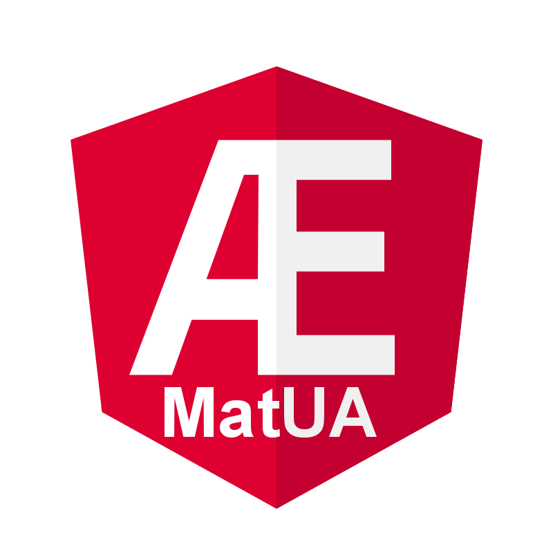

# MatUA



Welcome to the Material themed OPC UA GUI Creator.
This software is intended for use in supervision of industrial machines that implement OPC UA Servers. The GUI creation is managed by so called "blocks" that will contain charts from the eCharts library (Baidu).

Currently the software is NON working, which means that any functionality is only in experimental state, without any function as it is being prototyped. 

I decided to put up the repository in public in hope that there is some people out there who feel like contributing, since it is a lot of work for a single person.

The goal of this project is to create an HMI like solution for a fast overview of industrial systems with an easy to use interface, exportable and importable configurations for portablility and speed of deployment.

First off I'd like to give credit to the repositories and people:
* [node-opcua](https://github.com/node-opcua/node-opcua) by erossignon
* [angular-electron](https://github.com/maximegris/angular-electron) by maximegris
* [ngxecharts](https://github.com/xieziyu/ngx-echarts) by xieziyu
* [electron](https://github.com/electron/electron)
* [angular](https://github.com/angular/angular)

And of course many more module creators that made all of this possible.

## Building and developing

To serve the application in a hot reload environment, just do
```npm
$ npm start
```

To build and deply executable for different platforms, do:
* Windows:
``` npm
$ npm electron:windows
```
* Linux:
``` npm
$ npm electron:linux
```
* MacOS:
``` npm
$ npm electron:mac
```
